<div align="center">

# PlotVista

### Sales operations for real estate, reimagined as one live workspace.

PlotVista turns a static master plan into a tappable, multi-user platform — every plot, every customer, every rupee, in sync across every device.

<br>

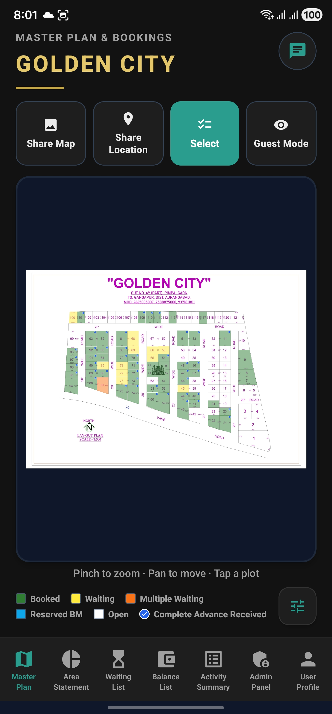

<br>
<br>

[Live demo](#)&nbsp;·&nbsp;[Features](#what-it-does)&nbsp;·&nbsp;[Architecture](#how-it-works)&nbsp;·&nbsp;[Gallery](#gallery)&nbsp;·&nbsp;[Tech](#built-with)&nbsp;·&nbsp;[Getting started](#getting-started)

</div>

---

## The problem

Real-estate sales teams still run their entire site from printed master plans, WhatsApp threads, and an unforgiving spreadsheet. The map says one thing, the booking register says another, the cashier says a third — and the customer is on the phone right now.

## The product

PlotVista replaces all of that with a single mobile workspace. The master plan becomes interactive. Plots have a lifecycle. Customers have a queue. Payments have an audit trail. And every change lights up on every other phone the instant it happens.

---

## What it does

**An interactive master plan.** Pinch, zoom, and tap your way around the site. Plots are drawn as live polygons, coloured by status, and respond to touch with sub-pixel hit testing — no list scrolling required.

**A real plot lifecycle.** Vacant → waiting → booked → transferred → reserved. Each transition is guarded, validated, and recorded with a full before/after snapshot of who, what, when, and why.

**A self-reordering waiting queue.** Multiple waiters can sit on the same plot. Remove the first and the second shifts up. Promote the third and the queue reflows. Positions stay correct everywhere, automatically.

**Realtime, everywhere.** A WebSocket layer pushes every plot mutation to every connected client in milliseconds — no refresh, no reload, no stale data.

**Bookings, payments, and EMI tracking.** Capture customer details, advance amounts, payment modes, scholar vs regular pricing bands, and an EMI schedule that lives next to the plot it belongs to.

**Audit trail, not just history.** Every action becomes a structured activity log entry, searchable and filterable. Nothing is silently overwritten.

**Reports that match the floor.** Area statements, balance sheets, waiting lists, and an activity summary — all generated from the same source of truth as the map.

**Secure access by design.** JWT authentication with email-OTP login, device-trust tokens, optional biometric confirmation for sensitive actions, and a centralized role matrix (super-admin · owner · guest).

**Built-in collaboration.** A community chat channel powered by CometChat, activity broadcasts to a notification group, and push notifications via Firebase Cloud Messaging.

**Automated backups.** Scheduled exports to Google Drive every six hours (XLSX + JSON), with map snapshots through Cloudinary, so the team can sleep.

---

## How it works

<div align="center">

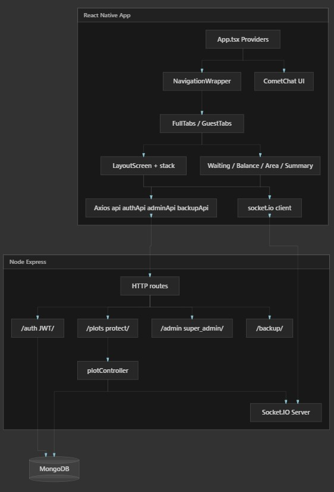

</div>

The app is a React Native client talking to a Node.js + Express API backed by MongoDB. REST handles authenticated reads and writes; Socket.IO carries realtime fan-out. Auth is JWT with optional email OTP and device-trust short-circuiting. CometChat and Firebase Cloud Messaging plug in on the side for chat and push, and Cloudinary + Google Drive sit behind the backup workflow.

The frontend is organized around three pillars:

- **Contexts** — `Auth`, `Theme`, `Alert`, and `UserAvatar` provide a stable runtime shell for every screen.
- **Navigation** — a top-level stack switches between Login, Pending Approval, and the main app; inside the app, bottom tabs adapt to the user's role.
- **Permissions** — a single role-to-capability map drives what every screen can render and do. No `if (role === 'admin')` scattered across the codebase.

---

## Gallery

<table>
  <tr>
    <td align="center"><b>Master plan</b><br></td>
    <td align="center"><b>Multi-selection</b><br></td>
    <td align="center"><b>Plot details</b><br>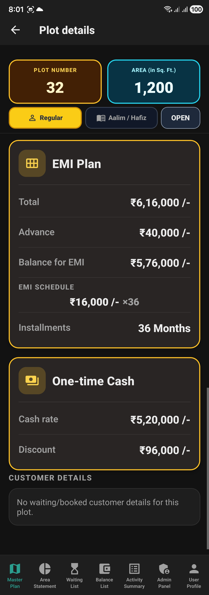</td>
  </tr>
  <tr>
    <td align="center"><b>Multi-plot summary</b><br>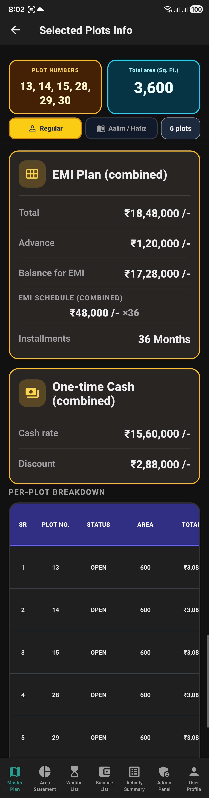</td>
    <td align="center"><b>Area statement</b><br>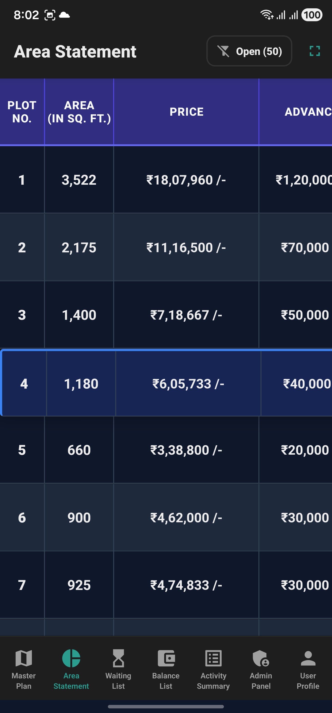</td>
    <td align="center"><b>Waiting list</b><br>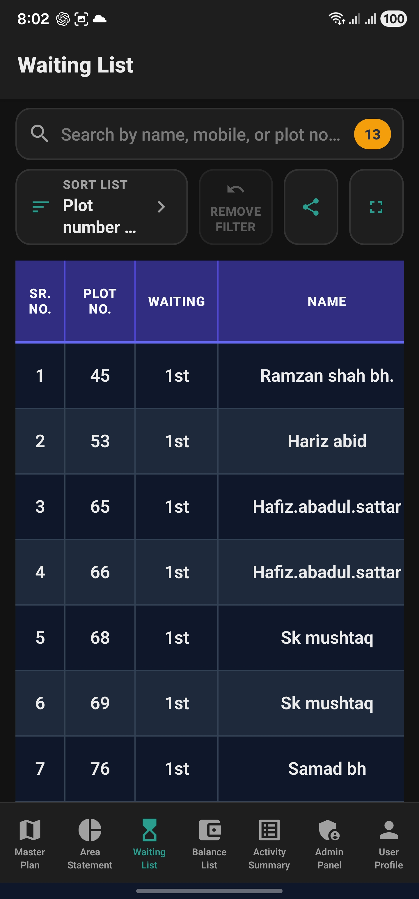</td>
  </tr>
  <tr>
    <td align="center"><b>Balance list</b><br>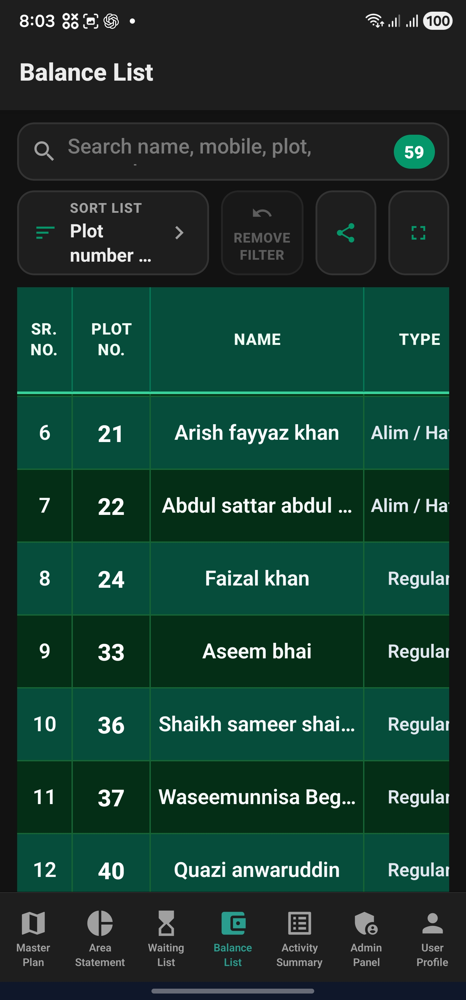</td>
    <td align="center"><b>Activity summary</b><br>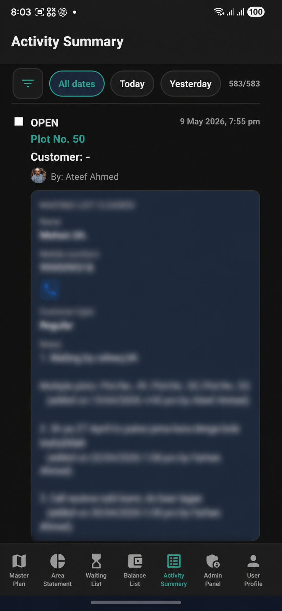</td>
    <td align="center"><b>Admin panel</b><br>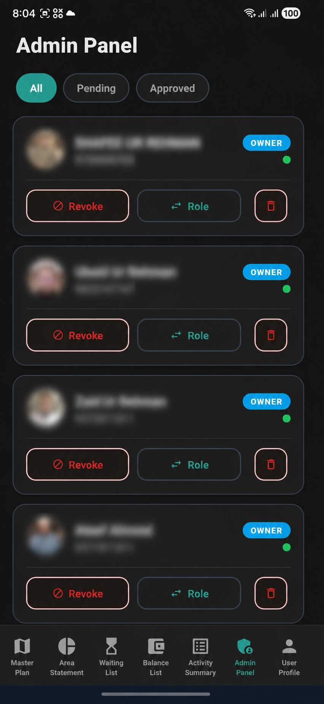</td>
  </tr>
  <tr>
    <td align="center"><b>Group chat</b><br>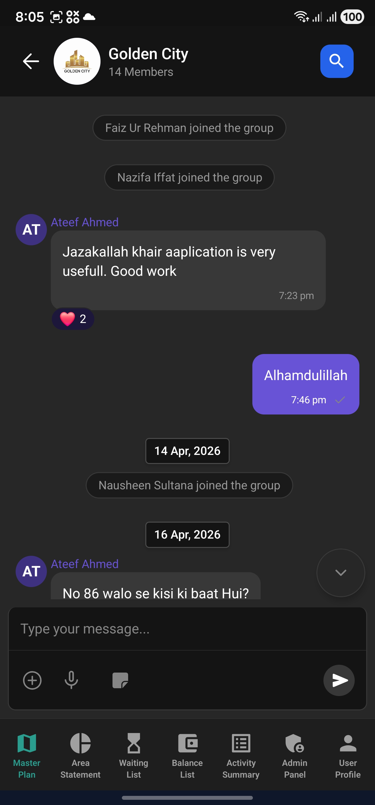</td>
    <td align="center"><b>Search messages</b><br>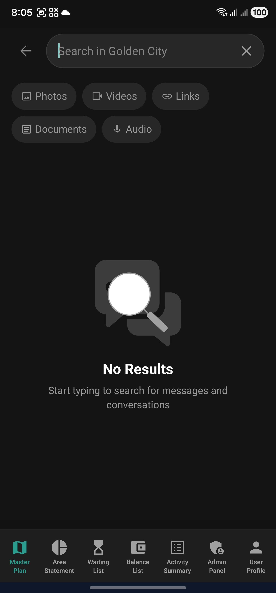</td>
    <td align="center"><b>Profile</b><br>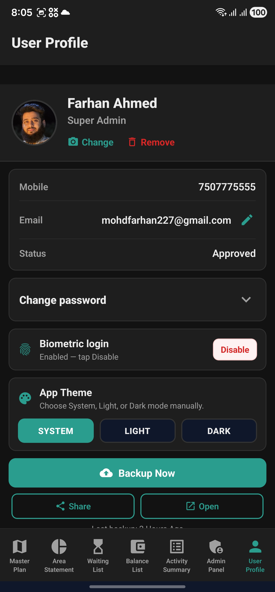</td>
  </tr>
  <tr>
    <td align="center"><b>Login</b><br>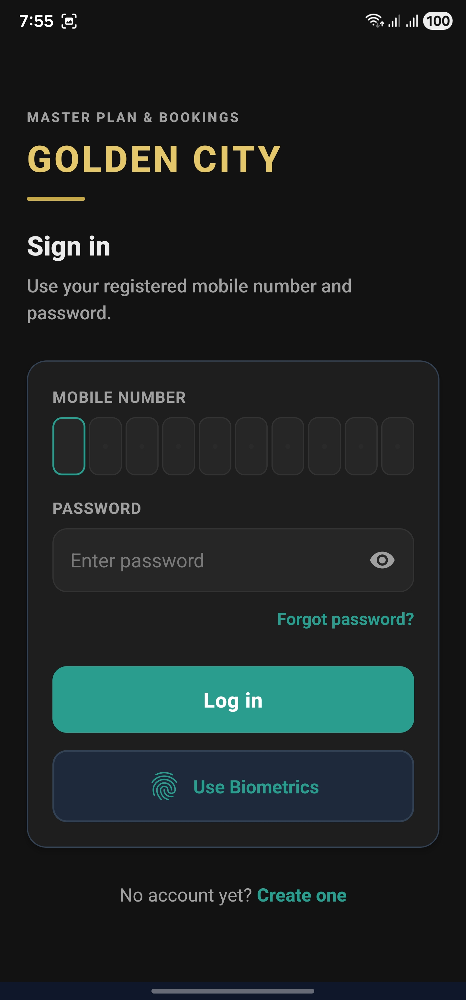</td>
    <td align="center"><b>Sign up</b><br>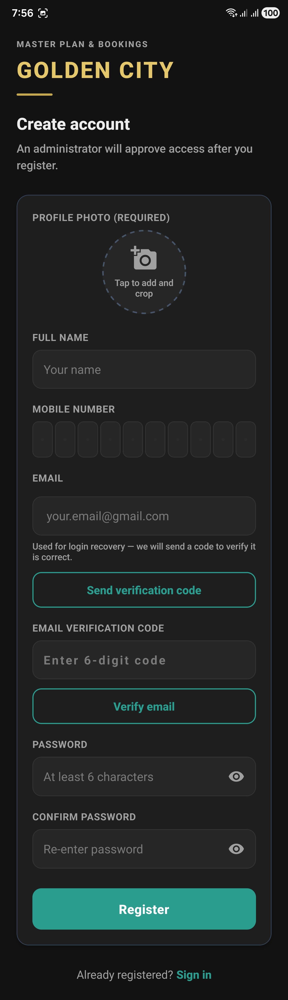</td>
    <td align="center"><b>Pending approval</b><br>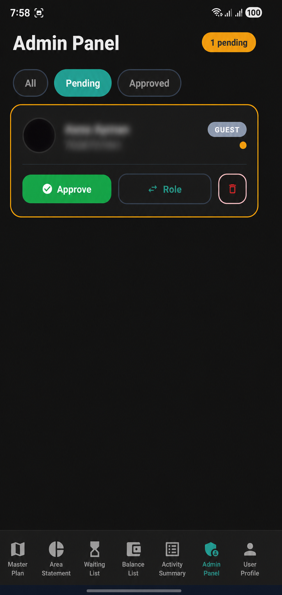</td>
  </tr>
</table>

---

## Built with

**Frontend** — React Native · React 19 · TypeScript · React Navigation · Axios · Socket.IO client · CometChat Chat SDK & UI Kit · Firebase Cloud Messaging · Notifee · dayjs · SVG · Zoomable View · view-shot · biometrics · AsyncStorage · Excel & PDF libraries

**Backend** — Node.js · Express · MongoDB / Mongoose · JWT · Socket.IO · node-cron · Cloudinary · Google Drive API · deployed on Railway

**Tooling** — ESLint · Prettier · Jest · Metro · Gradle · CocoaPods

---

## Getting started

### Requirements

- Node.js **22.11+**
- React Native **0.84.x** toolchain (see the [official setup guide](https://reactnative.dev/docs/set-up-your-environment))
- A reachable PlotVista backend, a CometChat app, and a Firebase project

### Install

```bash
git clone (https://github.com/Farhan22798/plot-vista-frontend.git)
cd PlotVista/frontend
npm install
```

### Configure

```bash
cp .env.example .env
```

| Variable | Purpose |
|----------|---------|
| `API_URL` | Backend base URL (no trailing slash) |
| `COMETCHAT_APP_ID` · `COMETCHAT_REGION` · `COMETCHAT_AUTH_KEY` | CometChat application credentials |
| `COMETCHAT_COMMUNITY_GROUP_ID` | Community chat group GUID (optional override) |
| `COMETCHAT_NOTIFICATION_GROUP_ID` | Notification group GUID (optional override) |
| `COMETCHAT_FCM_PROVIDER_ID` | FCM provider ID from the CometChat dashboard |

For release builds, mirror the same keys in `.env.production`.

### iOS (macOS only)

```bash
cd ios
bundle install        # first time only
bundle exec pod install
cd ..
```

### Run

```bash
npm start             # Metro
npm run android       # default Android debug
npm run ios           # iOS

# Android product flavors
npm run android:dev
npm run android:prod
```

If you're testing on a real device, point `API_URL` at your machine's LAN IP — `localhost` resolves to the phone itself.

---

## Scripts

| Command | What it does |
|---------|--------------|
| `npm start` | Start the Metro bundler |
| `npm run android` | Build and run on Android |
| `npm run android:dev` · `:prod` | Run a specific Android flavor |
| `npm run android:release` | Assemble a release APK (Windows `gradlew.bat`) |
| `npm run ios` | Build and run on iOS |
| `npm run lint` | ESLint |
| `npm test` | Jest |

---

## Roles

| Role | What they can do |
|------|-----------------|
| **Super admin** | Full access, plus user approvals, role changes, and admin panel |
| **Owner** | Full operational access — map, lifecycle, reports, chat |
| **Guest** | Read-only browsing of the map and the area statement |

Roles are defined once in `src/hooks/usePermissions.js` and consumed declaratively from there.

---

## Repository

This README covers the **frontend** package. The Node.js + Express + MongoDB backend lives alongside it in the `../backend` folder, and is where the API, audit logging, realtime fan-out, and scheduled backups are defined.

---

<div align="center">

**Built end-to-end — design, architecture, mobile app, backend, realtime layer, and deployment.**

</div>
